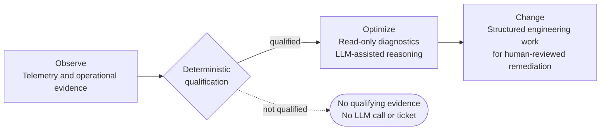

# Data & AI Architecture Decisions

Production-derived architecture decisions and case studies from enterprise data and AI platform work on Google Cloud. The emphasis is on workload shape, trust boundaries, failure modes, and the trade-offs behind systems that operate unattended.

> **What this is:** ADRs and case studies, sanitized of anything company-identifying, kept honest about trade-offs and rejected alternatives. See [`docs/sanitization-guidelines.md`](docs/sanitization-guidelines.md) for exactly what was removed and why.
>
> **What this isn't:** No proprietary source code, no internal names, URLs, credentials, or production thresholds.

## Start Here

For a hiring-manager review, use this order:

1. [AI Observability Platform Case Study](case-studies/ai-observability-platform.md) — the end-to-end production context and selected topology.
2. [ADR-0001 — Deterministic Qualification and Prioritization Before LLM Analysis](adr/0001-deterministic-detection-over-llm-qualification.md) — the flagship decision and LLM trust boundary.
3. [Architecture Diagrams](diagrams/) — system context, runtime topology, trust boundaries, deterministic detection, and knowledge lifecycle.



## Repository Structure

```
data-ai-architecture-decisions/
├── adr/                  Architecture Decision Records, numbered sequentially across all projects
├── case-studies/         Full case study per project — context, stack, diagrams, decision index
├── diagrams/             Mermaid architecture diagram sources (.mmd) referenced by case studies
├── templates/            Reusable ADR template
└── docs/                 Process docs (sanitization rules, etc.)
```

The Mermaid architecture diagrams cover system context, runtime topology, trust boundaries, deterministic detection, and knowledge lifecycle.

## Case Studies

| Case Study | Summary |
| :--- | :--- |
| [AI Observability Platform](case-studies/ai-observability-platform.md) | A closed-loop Observe → Optimize → Change system unifying query telemetry, live cluster metadata, and infrastructure signals, with deterministic detection and LLM-assisted synthesis |

## Architecture Decision Records

ADR-0001 is the finished flagship record. The remaining ADRs preserve accepted decisions as initial records and are intentionally not presented at the same documentation depth.

| # | Decision | Maturity |
| :--- | :--- | :--- |
| [0001](adr/0001-deterministic-detection-over-llm-qualification.md) | Deterministic qualification and prioritization before LLM analysis | **Flagship** |
| [0002](adr/0002-cloud-run-service-and-job-over-gke.md) | Cloud Run Service and Job over GKE | Initial |
| [0003](adr/0003-mcp-tool-contracts-over-in-process-tools.md) | MCP tool contracts over in-process tools | Initial |
| [0004](adr/0004-git-native-knowledge-over-vector-rag.md) | Git-native knowledge over vector RAG | Initial |

## Architectural Principles Behind These Decisions

1. **Managed services where they remove operational ownership** — not by default, but when the workload doesn't justify the control they'd cost.
2. **Deterministic controls on any path that autonomously files a ticket or otherwise creates engineering work.** Generative AI adds value in reasoning and synthesis, not in gating.
3. **Explicit trust boundaries** between read access, diagnostics, and anything that writes a change.
4. **Reviewable knowledge over opaque retrieval** wherever exact-match correctness matters more than fuzzy recall.

## About Me

Kuldeep Kumar — Data & AI Platform Architect, 16+ years across enterprise data warehousing, cloud data platforms, and AI/agentic systems on Google Cloud. [LinkedIn](https://www.linkedin.com/in/kuldeepk-10211190)

## License

Documentation in this repository is shared under the [MIT License](LICENSE). No proprietary source code is included. See [`CONTRIBUTING.md`](CONTRIBUTING.md) for how new ADRs and case studies get added.
