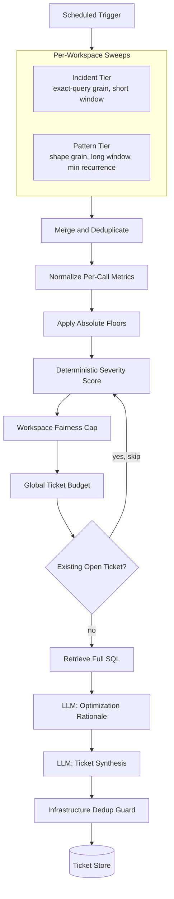

# ADR-0001: Deterministic Qualification and Prioritization Before LLM Analysis

**Status:** Accepted
**Date:** 2026
**Project:** AI Observability Platform
**Deciders:** Platform Architecture Lead

## Context

The platform runs a scheduled, fully unattended detection job with no human in the loop before it can generate engineering work. That job has to answer two questions correctly every run: which telemetry candidates are actually worth acting on, and — when several qualify at once — which ones get a ticket now versus which get deferred. Getting either answer wrong has an immediate, visible cost: a real degradation goes unticketed, or one noisy workspace floods the backlog and the team stops trusting the automation.

This is not a single ranking query. The system distinguishes two different failure shapes — an isolated acute spike versus a query shape that keeps quietly wasting capacity — and needs a data model that can tell "the same query, ticketed twice" apart from "a parametric variant of a query we already have open." Generative models are a natural fit for narrative triage of this kind of evidence, which is exactly why this ADR draws a hard line around where in the pipeline a model is allowed to participate.

## Decision Scope

This ADR covers the qualification, scoring, prioritization, and deduplication pipeline that runs before any model call, and the boundary at which the LLM enters. It does not cover: the Cloud Run execution topology the job runs on ([ADR-0002](0002-cloud-run-service-and-job-over-gke.md)), the tool-contract mechanism the downstream agents use to reach telemetry and metadata ([ADR-0003](0003-mcp-tool-contracts-over-in-process-tools.md)), how operator knowledge is stored ([ADR-0004](0004-git-native-knowledge-over-vector-rag.md)), or the internal safety controls of the optimization agent itself (read-only access scoping, statement validation, bounded tool-call budgets) — those controls are real and load-bearing, but they belong to a dedicated ADR on the optimization trust boundary once this one is settled.

## Decision Drivers

- Fully unattended execution — no human reviews a run before it can generate a ticket.
- Repeatability — the same input telemetry must produce the same qualification outcome, run after run.
- A hard ticket budget, both per-workspace and global, so one degraded workspace cannot consume the whole run's capacity.
- Flat, predictable cost and latency at a recurring cadence across every workspace.
- Auditability — every ticket must be traceable to a specific metric and threshold, not a model's judgment call.
- Coverage of the case where a whole workspace degrades uniformly, which a purely relative signal is structurally blind to.

## Candidate Model

The pipeline tracks two candidate types and three identifiers, and the distinction between them is the core of the design, not incidental detail:

- **Incident candidate** — grouped at exact-query grain, over a short lookback window, with a low minimum-occurrence bar. Built to catch an isolated spike the first time it happens, before it has run often enough to look like a pattern.
- **Recurring-pattern candidate** — grouped at normalized query-shape grain, over a longer lookback window, requiring a minimum recurrence count. Built to catch structurally inefficient queries that keep showing up with different literal values.
- **Exact-query fingerprint** — a hash of the literal SQL text. Used for incident-tier grouping, exact-duplicate ticket dedup, and retrieving full SQL when telemetry only captured a truncated preview.
- **Normalized query-shape fingerprint** — a hash of the query's structural shape independent of its literal values. Used for pattern-tier grouping and shape-level ticket dedup, so ten parametric variants of the same inefficient query roll up under one open ticket instead of filing ten.
- **Activity label** — a coarser, human-readable grouping used for first-look labeling and ticket titles. Deliberately *not* used as the grain for qualification or dedup, because one activity label can span many structurally distinct queries.

## Decision Pipeline

1. **Scheduled trigger.** A managed scheduler invokes the job on a fixed recurring cadence, unattended.
2. **Incident and recurring-pattern sweeps.** Per workspace, the job runs both tiers in parallel across a shared set of core performance metrics — the incident tier at exact-query grain over a short window, the pattern tier at query-shape grain over a longer window with a minimum recurrence count.
3. **Merge and deduplicate.** A candidate can surface in more than one sweep — a query that is both slow and CPU-heavy appears in both rankings — so rows are merged to one representative candidate regardless of how many metrics flagged it.
4. **Normalize cumulative metrics per execution.** Metrics that accumulate across calls are converted to a per-call basis before qualification, so a query's cost is judged per execution rather than inflated purely by how many times it ran.
5. **Apply absolute qualification floors.** Every candidate is checked against fixed per-metric floor thresholds. Any single floor breach qualifies the candidate for scoring — nothing reaches scoring by relative comparison alone.
6. **Calculate deterministic severity.** Qualified candidates get a severity score combining magnitude (how far past floor), frequency (call volume), breadth (how many metrics it breached), and known plan-warning signals.
7. **Enforce workspace fairness.** A bounded workspace quota advances the highest-severity candidates, so one noisy workspace cannot crowd out the rest of the fleet.
8. **Enforce a global ticket budget.** Across all workspaces, a bounded number of candidates advances per run, ranked by severity.
9. **Skip candidates with an existing open ticket.** Each remaining candidate is checked against the durable ticket store by shape fingerprint (and exact-query fingerprint); an open match causes a skip and promotes the next-highest-severity candidate in that workspace.
10. **Retrieve full SQL.** Telemetry may hold only a truncated preview; the pipeline fetches the full statement by fingerprint before handoff, so nothing downstream ever reasons from a preview.
11. **Invoke LLM optimization.** Only here does a model enter. It receives the qualified candidate's structured context — fingerprints, workspace, flagged metric, full SQL — and calls read-only diagnostic tools to produce a rationale and recommendations.
12. **Synthesize the structured ticket.** A second model call formats the optimization output into a fixed template. The ticket-creation tool itself re-checks fingerprint-level dedup as an infrastructure-level guard immediately before writing, so two overlapping runs still cannot create a duplicate.

## Decision

Qualification, scoring, workspace fairness, the global budget, and dedup are all **deterministic, reproducible code** — no model call anywhere in steps 1–10. The LLM is invoked only after a candidate has already qualified, and only to interpret evidence and produce language (rationale, recommendations, ticket prose) — never to decide whether a candidate proceeds.

## LLM Trust Boundary

The real decision here is not "no LLM" — it is a specific separation of responsibilities that holds throughout the platform:

- **Deterministic code decides whether a candidate proceeds** — qualification, scoring, fairness, budget, and pre-selection dedup are all steps 1–10 above, with zero model involvement.
- **Read-only tools gather evidence** — schema, index, and statistics lookups, plus plan inspection, are called by the optimization agent but are themselves non-generative.
- **The LLM interprets evidence and produces language** — it explains why a candidate is a problem and recommends what to change; it does not gate whether the candidate reached this stage.
- **A second model call formats the ticket** — into a fixed template, not a structure the model invents.
- **Infrastructure-level dedup is the final guard** — the ticket-creation tool itself checks fingerprints immediately before any write, independent of whatever the pipeline decided upstream, so a race between overlapping runs cannot produce a duplicate.

The optimization agent's own safety controls — read-only access scoped to metadata, statement validation, blocked mutating operations, dry-run defaults, and a bounded, single-pass plan-inspection protocol — are real and important, but they are a downstream concern from this boundary and belong in their own ADR.

## Alternatives Considered

1. **LLM qualification, given the same absolute metrics.** The model could technically be handed the same floor thresholds and asked to qualify. Rejected: prompt or model changes can shift qualification behavior even with the underlying metrics held constant; a per-candidate model call at a recurring cadence across every workspace turns a fixed-cost job into a variable-cost one; and a model's qualification calls are far harder to back-test and regression-test against historical telemetry than a formula is. Qualification has a much lower tolerance for nondeterminism than explanation does.
2. **Relative statistical anomaly scoring, with no absolute floor.** Statistically clean, no hand-tuned thresholds to maintain. Rejected as the sole mechanism specifically because of the uniform-degradation blind spot: when every candidate in a workspace degrades together, a peer-relative or cross-sectional signal can conclude nothing is unusual, which is exactly the scenario where a ticket matters most.
3. **Static thresholds with no severity scoring.** Simpler than the full pipeline. Rejected: without a severity score, many simultaneously-qualifying candidates can't be ranked or budgeted, which produces either arbitrary selection or unbounded ticket volume from a single noisy workspace.
4. **Human-only review, no automation.** Rejected as the primary mechanism: it doesn't scale to recurring, cross-workspace coverage, and reproduces the manual-hunting cost the platform exists to remove. It remains available as the interactive investigation surface for ad hoc, human-directed exploration outside the scheduled pipeline.

## Trade-offs

**Pros of the chosen route:**
- Every ticket is traceable to a specific metric, floor, and score — not a model judgment call.
- Flat, predictable compute cost and latency regardless of how many candidates a given hour produces.
- Workspace fairness and a global budget are structural guarantees, not something a model has to be prompted into respecting.
- LLM spend concentrates exactly where language reasoning earns its cost — rationale and ticket prose — not on the qualification gate.

**Cons / risks of the chosen route:**
- Floor thresholds require empirical retuning as workloads shift; they do not self-adjust.
- Absolute gates can miss a genuinely novel failure shape that has no historical magnitude signature yet, until thresholds or the knowledge base catch up.
- The two-tier, three-fingerprint model is more upfront design complexity than a single generic anomaly query.

## Failure Modes and Mitigations

| Failure Mode | Mitigation |
| :--- | :--- |
| Thresholds go stale as workloads evolve | Thresholds are tunable configuration, revisited when qualification rate drifts from historical baseline |
| One metric dominates the severity score | Severity combines four independent signals (magnitude, frequency, breadth, plan-warning), back-tested against historical incidents |
| Cumulative metrics unfairly favor high-frequency queries | Per-call normalization runs before qualification, not after |
| Repeated literals create ticket spam without shape-level identity | Pattern tier groups by shape fingerprint; ticket dedup checks shape fingerprint, not only exact-query fingerprint |
| One degraded workspace consumes the whole global budget | Workspace fairness cap is enforced *before* the global budget cap |
| Missing or truncated SQL blocks downstream optimization | Enrichment step retrieves full SQL by fingerprint before handoff |
| Overlapping scheduled runs duplicate work | A distributed lock scoped to slightly exceed the job's expected runtime blocks concurrent execution |

## Validation and Operability

- Deterministic unit tests cover qualification and ranking logic directly — no model in the test loop for this stage.
- Threshold and formula changes are replayed against historical telemetry windows before being trusted on live data.
- Threshold changes go through the same review process as any other tunable production parameter, not an ad hoc edit.
- New qualification logic runs in shadow mode — computing candidates and scores without filing tickets — before ticket creation is enabled.
- Dry-run ticket generation is a standing default, not just a rollout step, so the full pipeline can be exercised safely at any time.
- Each run emits counts for candidates evaluated, qualified, skipped-as-duplicate, and filed, so drift in any stage is visible without reading logs line by line.

## Operational Consequences

Improving detection reliability is data- and threshold-engineering work, owned like any other tunable production parameter — not prompt engineering. The optimization and ticket-synthesis stages remain LLM-assisted but are strictly downstream of a qualification gate the model never touches. "Anything that autonomously creates or prioritizes engineering work" is the correct frame for what this pipeline does — it files tickets for a human to review and act on, not pages that interrupt someone; the human reviews the proposed remediation, not the qualification decision that got it there. Overlapping-run and duplicate-ticket protection are infrastructure concerns (distributed lock, fingerprint dedup), not something left to agent behavior or prompt discipline.

## Revisit Triggers

- Qualification rate (candidates qualified ÷ candidates evaluated) drifts materially from historical baseline.
- Ticket-filing volume regularly approaches the global budget cap, suggesting the cap or the thresholds need re-tuning.
- A workload change — a new workspace onboarded, a schema change — invalidates prior threshold tuning.
- The cost or reliability profile of the model calls downstream changes enough to warrant re-examining the optimization and synthesis stages (this does not, by itself, reopen the qualification boundary — see Decision Scope).

## Related Decisions

[ADR-0002](0002-cloud-run-service-and-job-over-gke.md) (execution topology) · [ADR-0003](0003-mcp-tool-contracts-over-in-process-tools.md) (tool access) · [ADR-0004](0004-git-native-knowledge-over-vector-rag.md) (knowledge storage). These three remain at their original depth pending the same treatment applied here.

## Sanitization Note

Identifiers, index names, ticketing-system specifics, and exact threshold values have been generalized per [`docs/sanitization-guidelines.md`](../docs/sanitization-guidelines.md). The architecture — two candidate tiers, three fingerprint types, the qualify → score → fairness → budget → dedup sequence, and the LLM trust boundary — is reproduced faithfully; only identifying detail has been removed.
