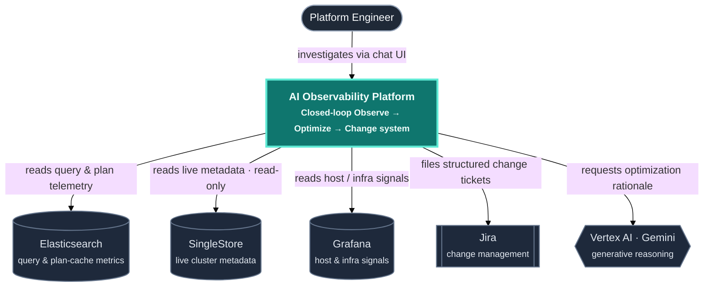
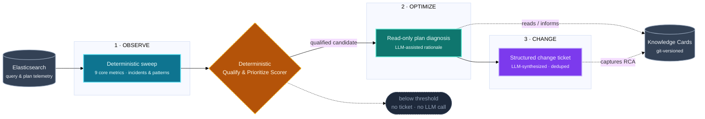
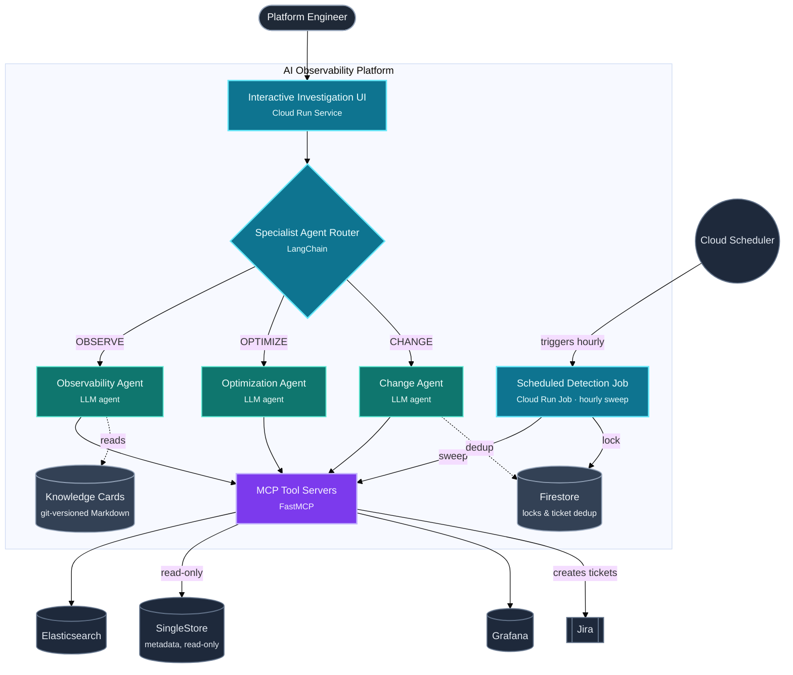
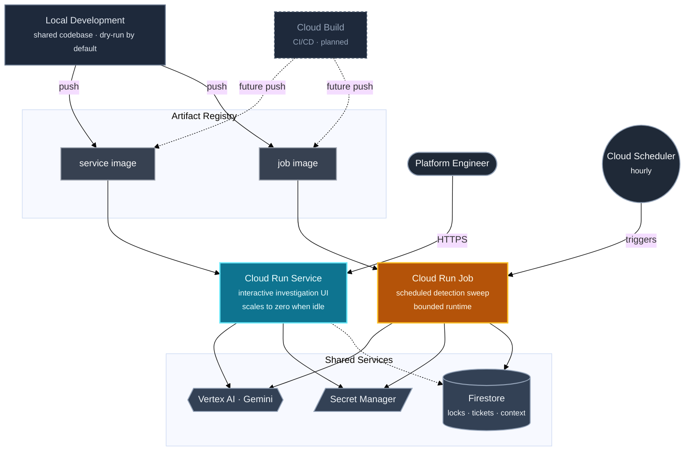

# Case Study: AI Observability Platform (Observe → Optimize → Change)

**Related decisions:** [ADR-0001](../adr/0001-deterministic-detection-over-llm-qualification.md) · [ADR-0002](../adr/0002-cloud-run-service-and-job-over-gke.md) · [ADR-0003](../adr/0003-mcp-tool-contracts-over-in-process-tools.md) · [ADR-0004](../adr/0004-git-native-knowledge-over-vector-rag.md)
**Diagram sources:** [`diagrams/ai-observability-context.mmd`](../diagrams/ai-observability-context.mmd) · [`diagrams/ai-observability-loop.mmd`](../diagrams/ai-observability-loop.mmd) · [`diagrams/ai-observability-container.mmd`](../diagrams/ai-observability-container.mmd) · [`diagrams/ai-observability-deployment.mmd`](../diagrams/ai-observability-deployment.mmd)

## 1. Problem and Business Context

A distributed SQL analytics platform serving enterprise-scale reporting workloads fails in expensive-to-diagnose ways: query latency spikes, memory pressure, resource-pool saturation, and plan regressions after upgrades. Before this platform existed:

- Query and plan telemetry lived in Elasticsearch.
- Live cluster truth (session state, resource pools, plan cache) lived only in SingleStore's own metadata views.
- Corroborating host and infrastructure signals lived in Grafana.
- Root-cause knowledge lived in engineers' heads, with no durable, reviewable record.
- The handoff from "we found something" to "there's a tracked change ticket" was manual and inconsistent.

The mandate was to collapse **Observe → Optimize → Change** into one governed loop: cut mean-time-to-detect and mean-time-to-resolve, and turn every confirmed finding into both a durable change ticket and a reusable operator knowledge asset.

## 2. System Context

## 3. The Observe → Optimize → Change Loop

The core product idea in one picture: detection is 100% deterministic, the LLM is only invited in once a candidate has already qualified, and anything below threshold never reaches a human or a ticket queue.

## 4. Container View

## 5. Component Stack

| Architectural Layer | Technology Selected | Engineering Reason |
| :--- | :--- | :--- |
| **Ingestion / Transport** | Elasticsearch at query-fingerprint grain; Grafana panel queries; chat-based entry point (Cloud Run Service); Cloud Scheduler-triggered batch job (Cloud Run Job) | Hot-path telemetry already existed at the right grain; Grafana supplies host/pool corroboration Elasticsearch can't; human and scheduled triggers reuse one MCP tool surface instead of duplicating detection logic |
| **Orchestration / Logic** | LangChain multi-agent framework (ReAct-style specialists) + intent router; MCP tool servers (FastMCP) via `langchain-mcp-adapters`; deterministic qualify-and-prioritize scorer | Narrow per-agent tool scopes avoid "god-agent" failure modes; the shared MCP layer gives IDE/CLI tooling parity with the hosted UI; the LLM (Vertex AI / Gemini) is deliberately excluded from the alerting critical path — see [ADR-0001](../adr/0001-deterministic-detection-over-llm-qualification.md) |
| **Storage / Indexing** | Elasticsearch; read-only SingleStore metadata views; Firestore for distributed locks and ticket dedup; git-versioned Markdown knowledge cards | Separates hot telemetry, live cluster truth, durable change state, and operator knowledge — each gets the consistency model it actually needs |
| **Observability / Compute** | Python runtime; Cloud Build CI/CD (in progress — local dev currently publishes both container images directly to Artifact Registry); Secret Manager for credentials; per-caller query hard-limits | Empirically tuned budgets stop runaway agent loops; dry-run-by-default and schema validation keep both deploys and the knowledge base honest even before CI/CD lands |

## 6. Deployment Topology

Interactive investigation runs as a **Cloud Run Service** (chat-style UI) that scales to zero when idle, not an always-on process. The hourly detection sweep runs as a **Cloud Run Job** invoked by **Cloud Scheduler**. Both are built from one shared codebase but packaged as two separate container images, so an image-only update to either surface preserves secrets, networking, and service-account bindings out of band. A **Firestore**-backed distributed lock (tuned to slightly exceed the job's expected runtime) and a content-hash dedup key prevent overlapping runs and duplicate tickets. CI/CD via **Cloud Build** is on the roadmap; today, both images are built and pushed straight from local development, which is a deliberate near-term trade-off, not an oversight — see the diagram below.

A managed multi-agent hosting product was evaluated for both flows and rejected — the production-critical path is a deterministic batch scorer plus a small set of custom tool servers, not an agent-mesh-native workload. A Kubernetes-based deployment was also evaluated and rejected: cluster lifecycle, node pools, and autoscaler tax are unjustified for a workload that is bursty on the batch side and modest in concurrency on the interactive side. Full reasoning: [ADR-0002](../adr/0002-cloud-run-service-and-job-over-gke.md).

## 7. Results in Practice

The same codebase runs both the interactive UI and the unattended hourly monitor, replacing what was previously a fully manual loop: an engineer scanning Grafana/Elasticsearch by hand, copying SQL into SingleStore for a manual `EXPLAIN`, then writing up a Jira ticket from scratch with no dedup and no standard template. Now the monitor deterministically qualifies outliers every hour at zero LLM cost for sweeps that don't clear the bar, and hands off to the LLM only for optimization write-ups and structured ticket filing on the candidates that do.

Operator knowledge is captured as git-versioned Markdown cards — known issues, SingleStore concept references, metadata-view references, Grafana dashboard references — validated against a JSON Schema and compiled to a generated index by a GitHub Actions gate on every pull request that touches the knowledge base, so a card that drifts from the committed index fails CI rather than silently going stale. There is no vector index and no runtime knowledge-serving database; the generated index is a build artifact of the Markdown, not a compiled catalog agents query separately — see [ADR-0004](../adr/0004-git-native-knowledge-over-vector-rag.md). Dry-run defaults make the platform safe to run locally with zero production credentials.

## 8. Architectural Principles Behind This System

1. **Managed services where they remove operational ownership** — not by default, but when the workload doesn't justify the control they'd cost.
2. **Deterministic controls on any path that pages a human or files a ticket.** Generative AI adds value in reasoning and synthesis, not in gating.
3. **Explicit trust boundaries** between telemetry access, read-only diagnostics, and anything that writes a change.
4. **Reviewable knowledge over opaque retrieval** wherever exact-match correctness matters more than fuzzy recall.

---
*Pattern summary: multi-agent specialists on a shared MCP tool-contract fabric; git-native operator knowledge; deterministic detection with LLM-assisted synthesis; a dual-runtime deployment aligned to interactive vs. batch control loops.*
